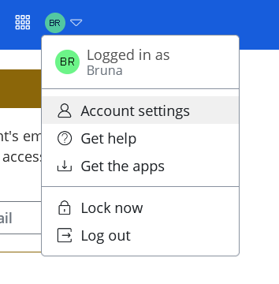
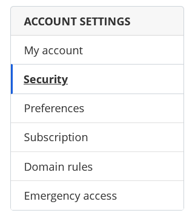
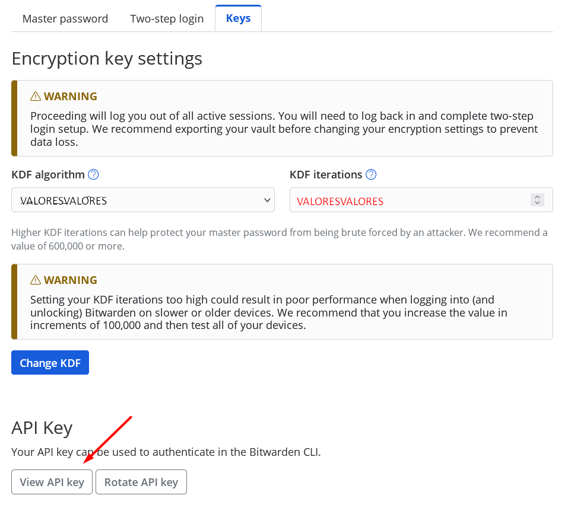
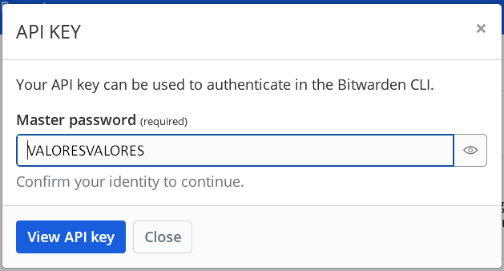
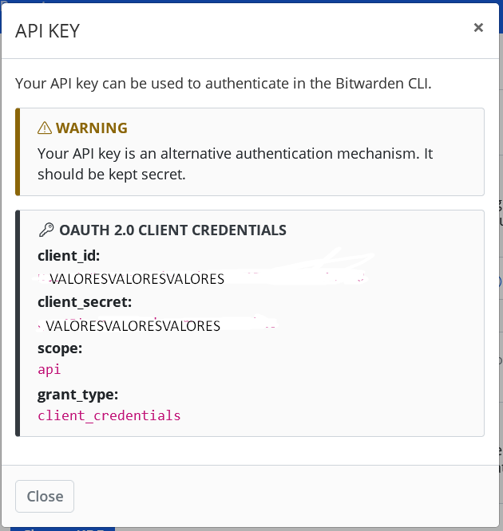

# Exemplo para uso da API Bitwarden

- criar venv
- ativar venv
- instalar coockiecutter
- baixar template botcity web bot
- adicionar dependencia do bitwarden no requirements
- instalar dependencias
- setar webdriver
- carregar secrets Bitwarden no sistema
- conectar API Bitwarden
- desenvolver lógica para acessar e preencher o form
- verificar os resultados

## Onde pegar as chaves?
Após fazer signup na Bitwarden, seguimos alguns passos:

- Acessar o menu do usuário e selecionar _Account settings_

- Acessar a opção _Security_ no menu lateral de configurações

- Selecionar a aba _Keys_ e clicar em _View API Key_
 

- Confirmar a senha do usuário

- Copiar a chaves de acesso

- Utilizá-las como _Variáveis de Ambiente_ no sistema
